# Qualtrics: Basics {#sec-qualtrics-basics}

This chapter will cover some basic concepts involved with setting up a survey in Qualtrics. Here is what we'll cover:

-   Starting the survey creation process
-   Question blocks and the survey flow
-   Editing a question
-   Inserting new questions
-   Updating question wording and flow based on responses to prior questions

Note: images in this document have a 'lightbox' class, which means that you can click on them to pop them out and get a slightly closer look.

## Starting the process

Step 1, naturally, is logging in to Qualtrics via [this webpage](https://leidenuniv.eu.qualtrics.com/){target="_blank"}. At that point you will see a page like this:

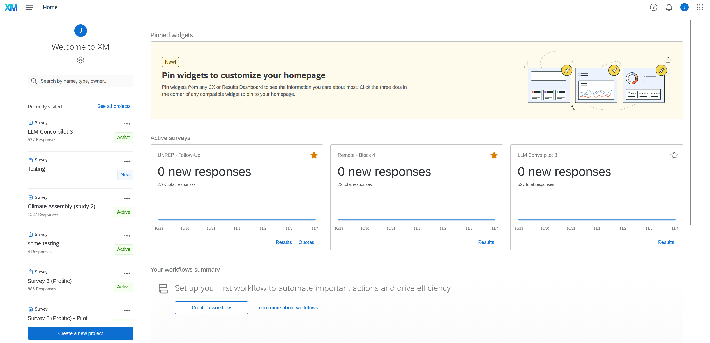

The left hand column shows the various projects in your Qualtrics. In your case, there shouldn't be any at first since you're just starting, but once you have created one then it will appear here.

The middle part will show active surveys and how many responses they have received in the recent days. Again, this will be blank at first and only relevant once you have distributed your survey to actual people to complete.

The most important thing for you, at this point, is the "Create a new project" button that is shown at the bottom of the screen. Click that button to start the process of creating a survey. From there, select: survey; get started; give a name to your survey; and select 'create project'. Here is a .gif showing the process.

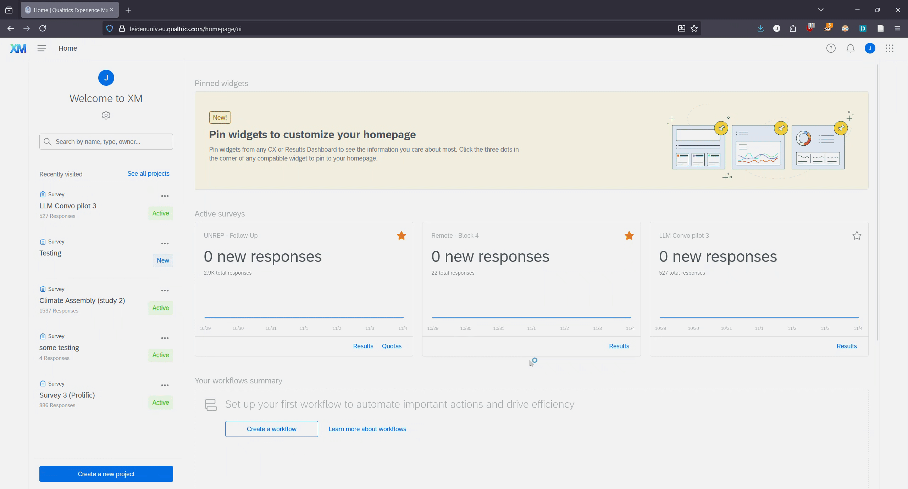

## Overview of the survey page

Here is the survey creation page in its default form. Let's get to know some parts of this page.

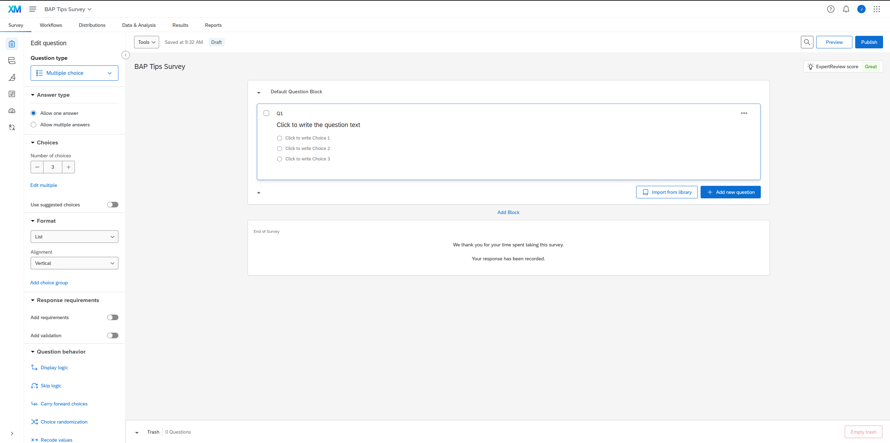

Let's start at the far left with the various icons. These icons represent different modes that you can select between as you're working. Here is an image with added text to indicate the meaning of the icons:

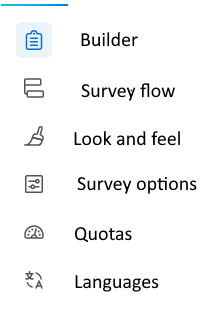

-   Builder: this is where you 'build' your survey, i.e., create and modify the questions that will make up the survey.
-   Survey flow: clicking this button will show you the "survey flow" for your survey, i.e., its organizational structure. I will discuss this further in coming sections/chapters.
-   Look and feel: clicking this button will bring up options for changing how your survey looks (e.g., its theme, font, etc.).
-   Options: these are general options. In general you will not need to deal with this much as the default options here are good.
-   Quotas: you can ignore this
-   Languages: This handles the base language for the survey.

## Question Block and Survey Flow {#sec-question-block-and-survey-flow}

Qualtrics surveys are organized around question blocks. A default question block is added when you first create the survey:

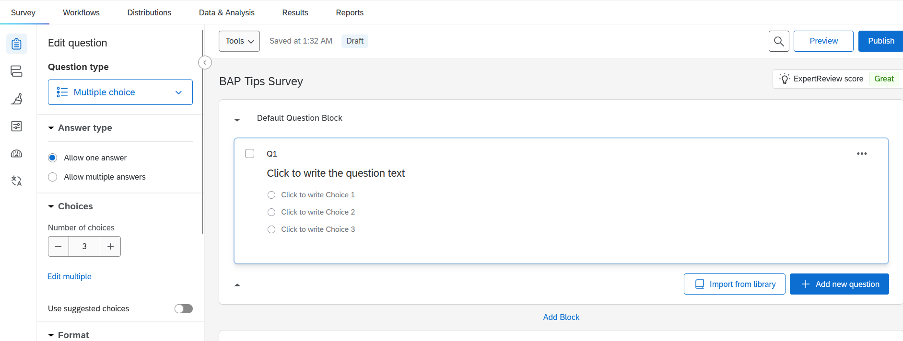

Each question block can feature one or more questions within them. In this case, we have a single multiple choice question (Q1) albeit one without any content yet. In practice, you should include questions on the same topic within a question block. For instance, you might have a single question block for demographic questions (age, gender/sex, etc.), another for political ideology, another for a third topic, etc.

The top of the block provides the name of the question block which is "Default Question Block" in our current instance. We can rename this block by clicking on this text and giving the block a more informative name. You should do this in practice because it will help you organize your survey later on when working in the Survey Flow area of Qualtrics.

There are a couple of ways to add blocks to our survey. First, we can click "Add Block" to, well, add another block. Alternatively, we can click on the three dots in the block to get some block options, which includes "Add block below". This latter route is more useful when you already have many blocks already and do not want to scroll down to the end of the page to click the "Add Block" option.

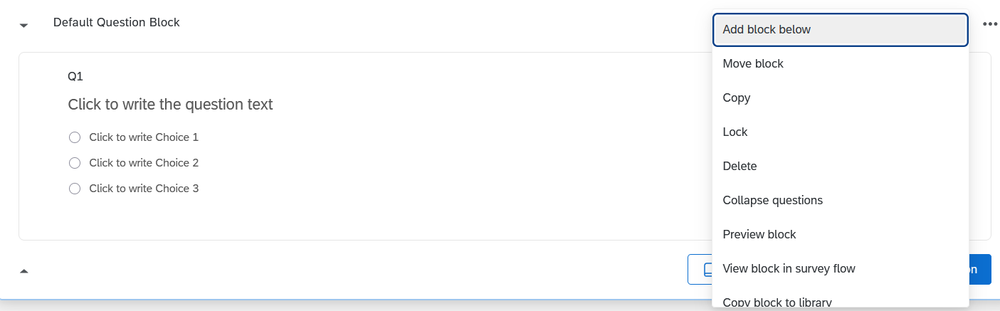

Blocks are the basic building, uh, blocks of our survey. We can naturally move them around so that the survey progresses in the way we want. The block options menu shown in the image above has a "Move block" option that you can use to do so. However, this is a little awkward to use in practice and especially so if you have a lot of blocks in your survey. A better option is to use the Survey Flow page. Let's take a look at what that page looks like (with future sections/chapters elaborating more on how you can use this page).

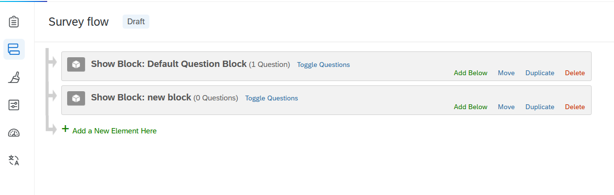

The image above shows the Survey Flow page for my survey at this point (and after I had added a second block which I imaginatively titled 'new block'). This area provides an overview of the basic flow of my survey. It indicates that respondent will first complete the question(s) in the "Default Question Block" block and then those in the "new block" area. I can re-arrange things, if I want, by clicking on "Move" for a block and then dragging and dropping it to where I want it to be. I would then need to hit the Apply button at the bottom of the page (not shown here) to make sure that my changes were saved.

Another important button here is "Add Below" which reveals various options:

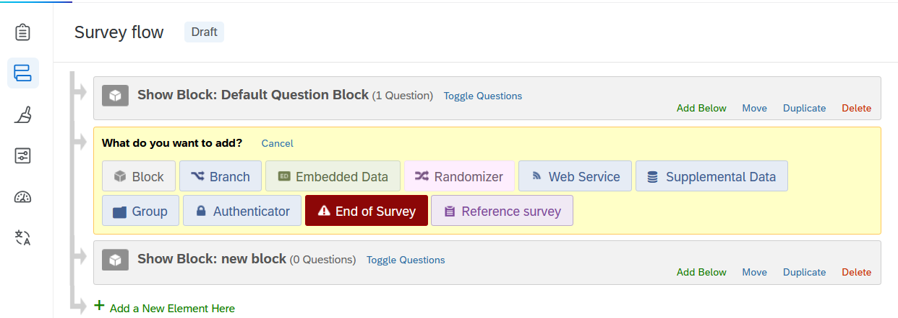

You do not need to know much about these various options at the present moment and some you likely will never need to know about (e.g,. Supplemental Data or Web Service). However, there are some options that may be useful for you (Branch, Randomizer, and Group) and which will be discussed more in further sections.

## Adding and Editing Questions

Let's turn to the process of creating/editing questions for our survey. We'll begin with the default question to get a sense of how to edit questions and then move on to adding new ones and some of the options available to you when doing so.

### Editing a question

Qualtrics has been nice to us and populated our Default Question Block with a multiple choice question:

At the top we can see "Q1". This is the name of the question. When you add another question it will be "Q2" and so on. You can click on Q1 and edit the name to something more informative. This is often a good idea beacuse it helps clarify to you what each column is supposed to represent. The name of the question will be the name of the variable in your eventual dataset, though, so if you want to make sure that any renaming that you do will not make your life harder later on when working in R or SPSS. For instance, changing the name of Q1 to "This is my first Qualtrics question" would be a terrible idea because statistical software packages do not play nicely with variable names that have spaces in them. Personally, I use lower case whole words (e.g., "leftright" or "pid") or [snake case](https://www.freecodecamp.org/news/snake-case-vs-camel-case-vs-pascal-case-vs-kebab-case-whats-the-difference/){target="_blank"} (e.g., "pid_lean", "race_eth") and keep them short but informative if/when renaming questions.

We then see "Click to write the question text" which is perhaps self-explanatory. We then see three multiple choice options; if we click on the text next to them we can write our answer options.[^qualtrics_basics-1]

[^qualtrics_basics-1]: There is a an "Edit Multiple" option on the left hand side of the screen under "Choices". This option enables us to edit multiple responses at once rather than edit each on in turn.

Let's see this in practice. Here, I'll create a question modeled on the US General Social Survey's [question](https://gssdataexplorer.norc.org/variables/187/vshow){target="_blank"} about whether the government is spending too much/too little/the right amount on education. Note: I've already written the question wording in a separate text file so that I could copy and paste for this .gif.

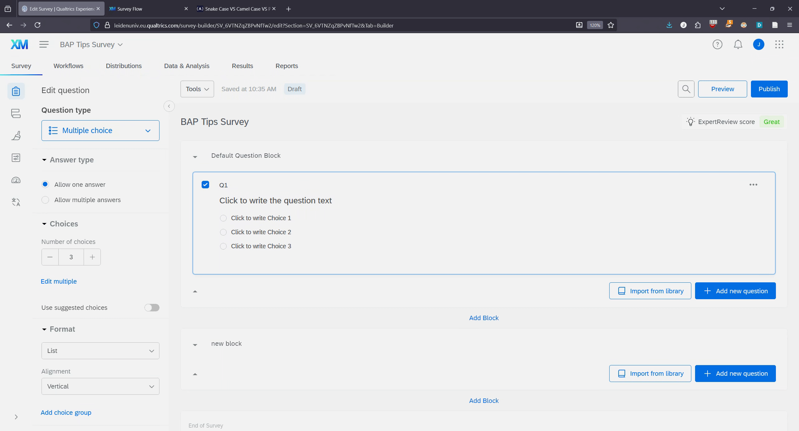

Yay, our first question! If we click on the three button menu option for the question we can select "Preview Question" to get a sense of what this will look like to those taking the survey.

::: {#qpreview layout-ncol="2"}
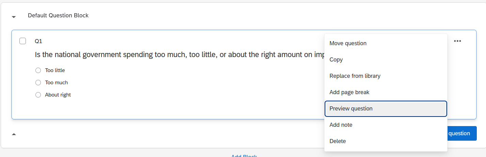

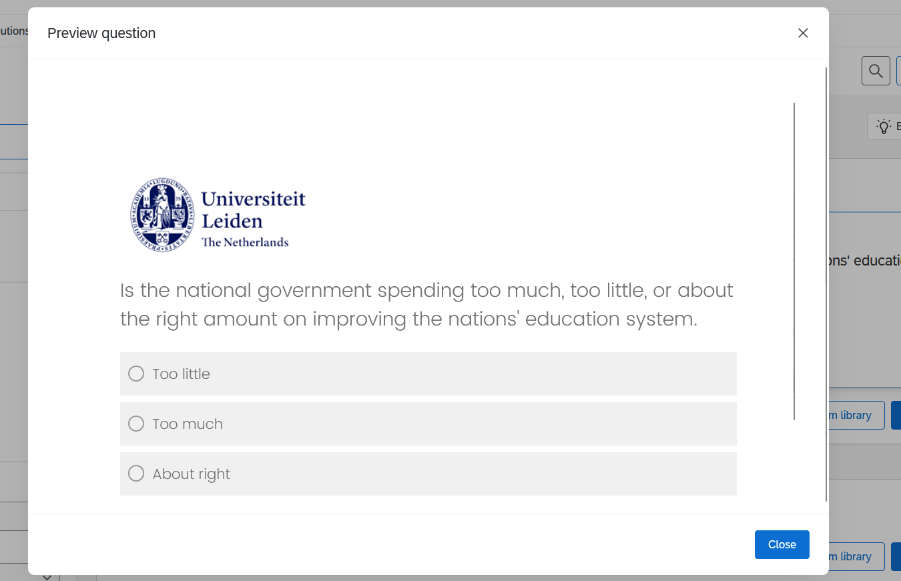
:::

You may have also noticed a Preview button at the top of the builder area as well, next to Publish. That Preview button lets us preview the survey as a whole and take it as if you were a respondent. You should do this several times before you circulate the survey to potential respondents to work out potential issues with the survey and survey flow.

### MC Question Options

If you click on a question, then you will see various options in the Edit Question column to the left of the question building area. Let's move down the column to see what options are available to you.

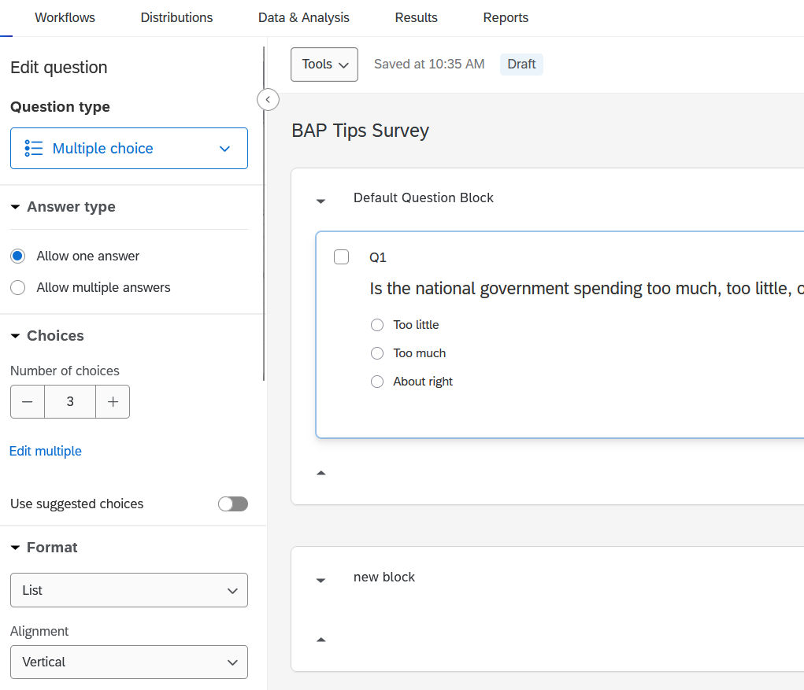

**Question Type**: Here you can change the question's type. I'll talk a little more about question types in the next sub-section.

**Answer Type**: Can respondents choose multiple options or only one? The default is "allow one answer". This is a sensible default for multiple choice questions. There can be situations where it makes sense to change this, but generally this can be left alone unless you have a good reason to do otherwise.

**Choices**: Here we can change the number of choice options. The default here was three but if we wanted to make this a 5-item or 7-item or whatever-item question, then we can increase/decrease the number accordingly. We also see an "Edit Multiple" option right below the Number of Choices part. We can click this option to give us a text box where we can edit the wording of all of our response options at once.

**Format**: You get three options here: (1) list (what you see in the image), (2) dropdown (people pick from a dropdown box), and (3) select box (they're giving a box with the different options and click on the one that they want). I would generally keep this as "list" for a multiple choice question. The one time I would consider a dropdown is when there are many, many, discrete response options (e.g., if I were asking US-based survey respondents what state they live in then I could simply have a dropdown box here instead of 50 options).

**Alignment**: You can choose to show the response options in a vertical alignment (as above) or a horizontal one (the response options are displayed next to each other). I believe vertical alignment plays better with people taking surveys on mobile phones, so I might consider defaulting to that option. You can preview what the survey would look like when taking it on a mobile phone when you Preview the survey (see @sec-preview-preview-preview).

There are some more options as well if we scroll down the page:

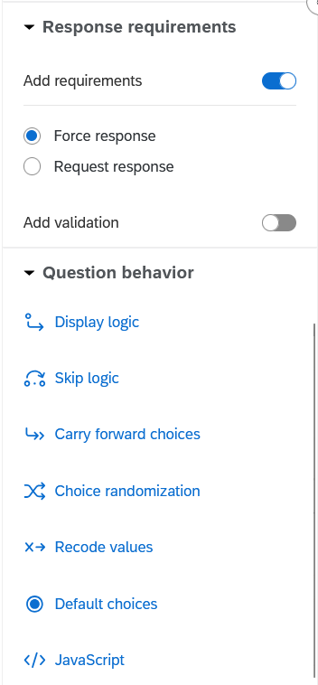

**Add Requirements:** (Note: this was off by default but I clicked it on so you could see the sub-options). The most relevant thing here is "Force response". If you toggle Add Requirements and select this option, then respondents will need to answer the question to move on in the survey. Should you do this? There are pros and cons here. Selecting this option enables you to avoid having missing data on the question and thus maximize the number of survey responses that you can use in your analyses. In addition, it's possible that you'll need a response on an item for some other purpose (e.g., when you first ask them for informed consent to take the survey or because it will influence the nature of the questions people get later on in the survey). However, forcing people to respond might have negative implications for data quality as well insofar as it annoys respondents, and, moreover, respondents should have the right to *not* answer our questions. The benefits likely outweigh the cons here.

**Add Validation**: You can ignore this.

**Question Behavior**: We now have a variety of options for question behavior.

-   [Display](https://www.qualtrics.com/support/survey-platform/survey-module/question-options/display-logic/){target="_blank"} and [skip](https://www.qualtrics.com/support/survey-platform/survey-module/question-options/skip-logic/){target="_blank"} logic cover situations where you want respondents to be shown this question (or not shown this question) under certain circumstances. I'll discuss this a little in a future section.
-   [Carry forward choices](https://www.qualtrics.com/support/survey-platform/survey-module/question-options/carry-forward-choices/){target="_blank"} enables you to "copy specific answer choices from a question and bring them into a future question in your survey".
-   [Choice randomization](https://www.qualtrics.com/support/survey-platform/survey-module/question-options/choice-randomization/){taret="_blank"} enables you to randomize the order of response options; I'll discuss this a little more in the next section.
-   [Recode values](https://www.qualtrics.com/support/survey-platform/survey-module/question-options/recode-values/){target="_blank"} enables you to change the numeric values associated with each response. The default options in my question, for instance, are 1 = too little, 2 = too much, and 3 = about right. If I wanted to change that behavior (e.g., make too little = 1, about right = 2, and too much = 3), then I could use this option to do that. The potential advantage is that this may preempt having to do this type of recoding later on in R/SPSS. However, I generally leave this alone to avoid screwing things up by accident.
-   [Default choices](https://www.qualtrics.com/support/survey-platform/survey-module/question-options/add-default-choices/){target="_blank"} is an option area which I do not think I've ever actually used. It's probably not relevant for your survey.
-   JavaScript: this would give you the ability to add Javascript code to do some advanced things...but again, this is almost certainly not required for your survey.

### Choice Randomization

One of the options noted above is Choice Randomization. Let's take a look at what we can do here:

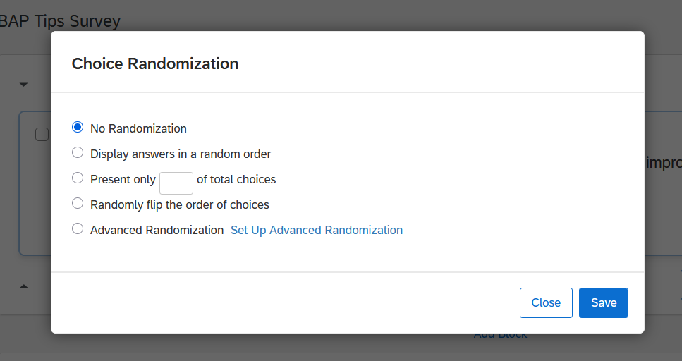

The default is "No Randomization" - the responses that you created will be shown in the order that you created them. For some questions this might not be problematic. The other options, meanwhile, enable you to randomize your responses in some manner.

Why (and when) might you want to randomize response options? Consider what it takes to answer a survey question: we need to read and interpret this question, recall information from memory, and then try to map this information to the response options before us.[^qualtrics_basics-2] Answering a survey question, in other words, requires some degree of mental effort. Ideally, respondents are willing and able to give this effort and thus answer our questions as well as possible. However, respondents may not always be so willing and able - perhaps they're not so interested in the topic or the survey is dragging on a bit or the question simply requires a lot of effort to answer. In such cases respondents might engage in "satisficing" behavior - they might take some type of shortcut to come up with a *good enough* answer for their mix of motivation and ability.[^qualtrics_basics-3] This could involve a respondent simply relying on the most immediate considerations that come to mind rather than canvassing their memory for additional relevant information. Or, it could mean simply choosing the first or last option offered since that is a very simple way to get through a survey.[^qualtrics_basics-4] This latter behavior would then induce a potential bias in our data with responses skewed to the first (or last) response option given to respondents. Randomizing choice options does not really help with the former sources of satisficing behavior, but it can help reduce the negative impacts of the latter type of behavior. I thus recommend some randomization in your response options.

[^qualtrics_basics-2]: [Tourangeau and Rasinski](Cognitive processes underlying context effects in attitude measurement.){target="_blank"} provide a classic account of this processes. You may see the link between this idea and our discussions of information processing and memory from class.

[^qualtrics_basics-3]: See [Kronick](https://catalogue.leidenuniv.nl/permalink/31UKB_LEU/rdnp04/cdi_proquest_miscellaneous_69540306){target="_blank"} for a discussion of the concept.

[^qualtrics_basics-4]: I recall being in college and receiving a telephone (!) survey from some university service. The interviewer would start reading out the response options, one after the other, and the survey starting to drag on and on with my desire to satisfice in just this way growing and growing.

Let's take a look at our options for choice randomization:

> Display answers in a random order

This will completely randomize the order of the response options. If I were to select this option for my 'are we spending too much' question, then some respondents might get 'Too Little \| Too Much \| About Right' as the response order and others 'Too Much \| About Right \| Too Little' and others 'About Right \| Too Little \| Too Much' and so on. This option is thus not particularly useful for items where the responses have some type of ordinal scale to them (e.g., not at all to extremely; strongly agree to strongly disagree). Instead, this option is more useful for questions with unordered categorical responses (e.g., what is your nationality; which candidate/party did you vote for).

> Present only \_ of total choices

This enables you to select some random number of options to show. I cannot think of a particularly good use case for this.

> Randomly flip the order of choices

Suppose that you have a question where there are five response options: strongly agree, agree, neither, disagree, strongly disagree. This randomization option will show some respondents the scale starting from strongly agree and going to strongly disagree but other respondents with get the flipped order, strongly disagree to strongly agree. I would recommend using this for your questions that involve an ordinal scale.

When you click on this option, you will then see a sub-option with a ticked box: "Consistently reverse the choice order for all questions with this randomization option selected." The Qualtrics help page says the following about this sub-option: "This option only appears after enabling “randomly flip the order of choices.” When enabled, this option will consistently randomize answer choice order for all affected questions in your survey." Suppose I set up my response options to range from strongly agree to strongly disagree - if Qualtrics randomly shows the respondent the question in the strongly disagree to strongly agree format (i.e., randomly flips the direction of the option) then it will also randomly flip the order for all subsequent questions where you ask it to randomly reverse the scale direction. Otherwise, Qualtrics will randomize the direction anew for each question. This is generally reasonable - having things flip around randomly from question to question can induce confusion among respondents and increase their cognitive load...which might lead them to satisfice!

> Advanced Randomization

This enables some additional customization to the randomization process. Let's take a peek at the options you get if you click on this and then "Set up Advanced Randomization"

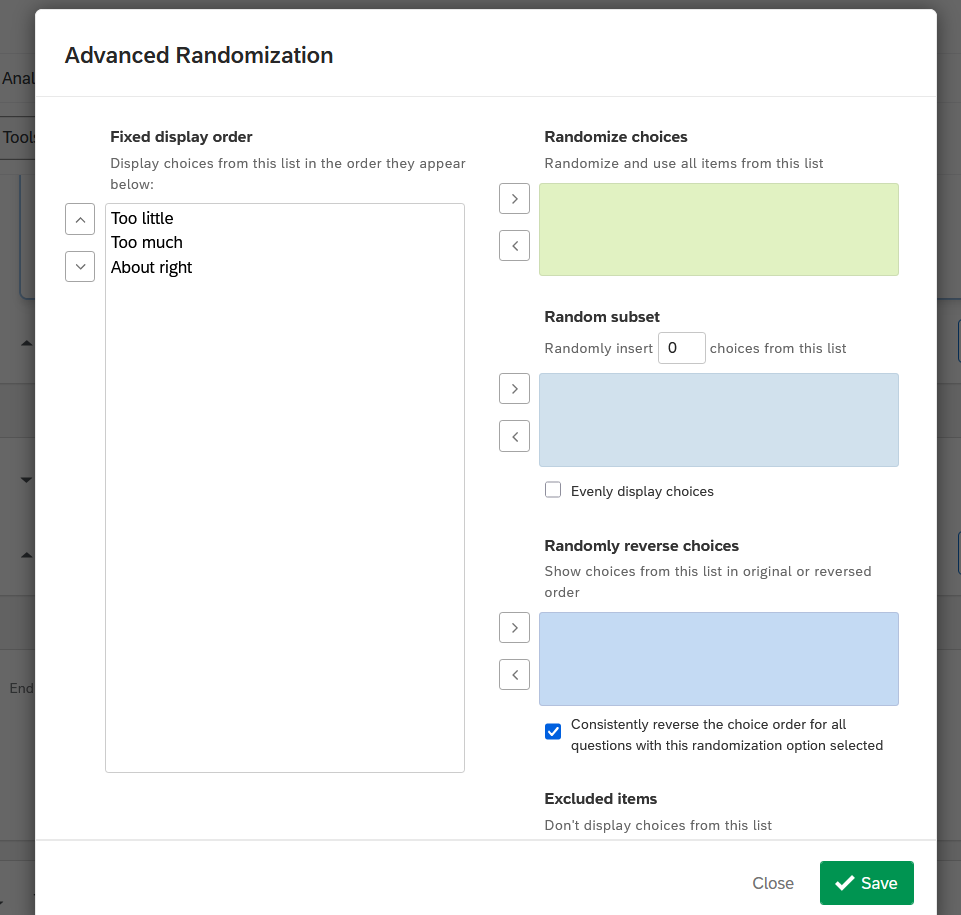

We see the response options for my question in the left box, under "Fixed display order". In essence, this shows us the current display order for the options. If we click on one of these options (or select them all), we can then add them to one (or more) of the boxes to the right. The most useful box here is "Randomize Choices". This option is useful if we want to randomize the order of only *some* of the responses. For instance, suppose that my question asked respondents who they voted for in the 2024 US President election with the following options: Donald Trump, Kamala Harris, Jill Stein, Some Other Candidate, and Did Not Vote. I might want to randomize the order of Trump, Harris, and Stein while leaving the other two options for the bottom of the list. I could do that by selecting the Trump, Harris, and Stein options and adding them to the "Randomize Choices" box at the top.

### Adding New Questions {#sec-adding-new-questions}

Thus far we've seen how to edit a question using the default question that Qualtrics populated our survey with as a base. Let's talk, then, about adding new questions to our survey.

Adding new questions is pretty straight forward. Just hit "Add New Question" within a block and a menu will pop up showing different types of questions that you might add. (There is another option here for adding new questions which I'll discuss in the next section as it is only sometimes useful.) Let's talk about some of the possibilities.

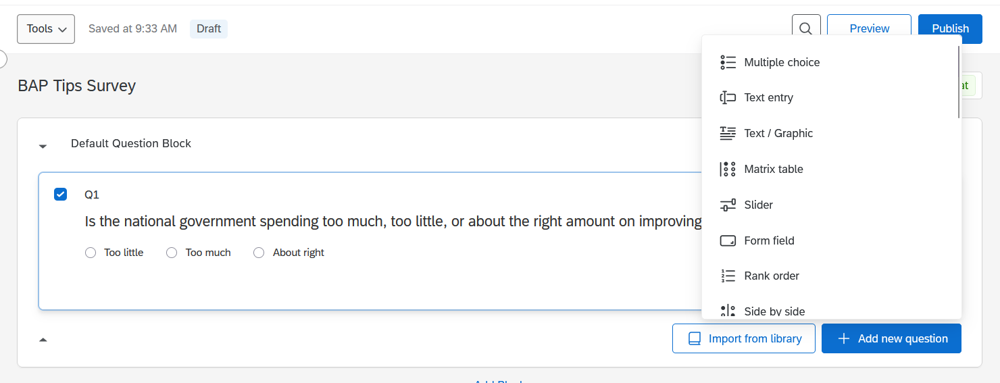

**Multiple Choice**: This will likely be your bread and butter question type. We've seen it already so I won't say more here.

**Text Entry**: This is for situations where you want to ask an open ended question.

**Text / Graphic**: This type of 'question' doesn't actually ask respondent a question per se since respondents are not provided with any response options. Instead, respondents just see some text. This type of question is particularly useful for creating segues between areas of your survey. For instance, suppose you begin with questions about people's political values and then segue into questions about their attitudes toward globalization. You might start the first block with a Text question that says something like "We'll begin by asking you some questions about your political attitudes" or something like that.[^qualtrics_basics-5] You might then include another Text 'question' as a segue to the following section as well, "We'll now ask you questions about your beliefs regarding globalization". Another use case for this type of question are experiments, e.g., providing the stimulus or the treatment that people are responding to, before asking them the specific questions you want to use in your analyses as dependent variables.

[^qualtrics_basics-5]: Alternatively, you might have segue Blocks that only feature this single question instead of incorporating it into the same block as the resulting questions. That can be useful if, for instance, you want to randomize the order of questions in the ensuing block. See @sec-bonus-question-randomization-within-a-block for more on that.

**Matrix Table**: You can think of this as a way of asking several multiple choice questions on the same topic in a slightly more efficient manner. For instance:

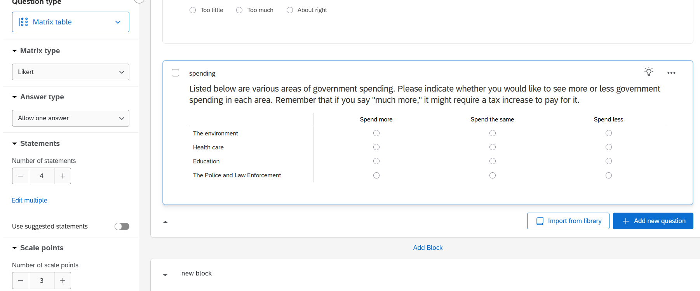

Here, respondents are asked to indicate whether they want more or less spent in four different areas. We can add/reduce the number of statements or the number of scale points for the question via the options to the left. While not shown here, one can also randomize the order of the different statements within the grid, which is generally a good idea.

This type of grid or matrix question can be useful when you have several items that share a common prompt/intro and have the same scale, i.e., the questions all deal with the same basic concept. The main trade off here is complexity. The table above only had four statements to evaluate. This type of set up would not work very well if there were many different rows/statements (although it might be reasonable to have two or three such tables rather than one giant one). This type of set up can also be awkward to answer on a mobile phone.

One thing to know about regarding these questions is the naming scheme. I named this question as "spending" but there are actually four questions here (one on the environment, one on health care, etc.). In my dataset, the four different questions would be represented by spending_1, spending_2, spending_3, and spending_4.

**Slider**: This is similar to the matrix question but here people can answer on a slider scale as below. For instance:

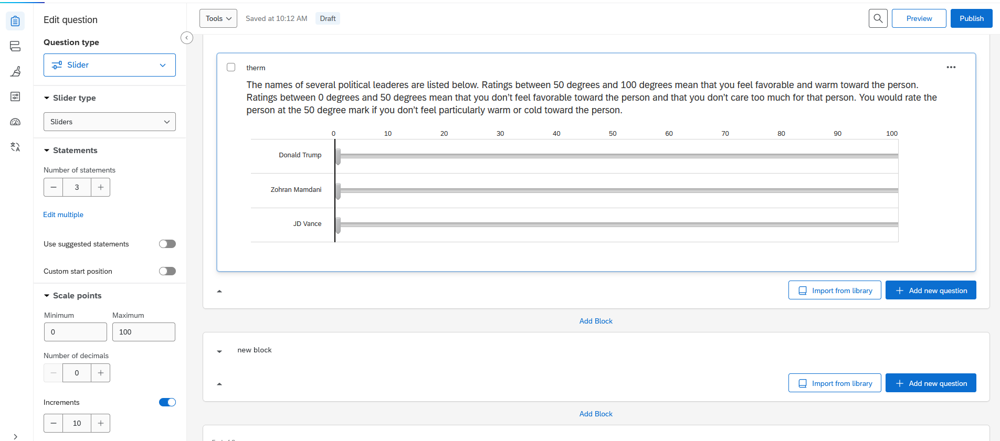

There are additional question types, but the above will likely cover 99.9% or even 100% of what you want.

### Import from Library

You may have noticed another option here: "Import from library". Let's click on that button to see what happens:

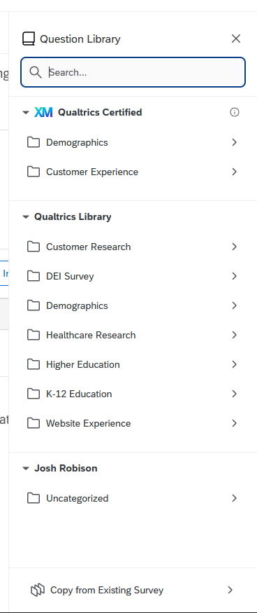

There is a 'question library' in Qualtrics with some commonly asked questions. You can use this option to import questions from this library into your survey. I think the most relevant options here are for demographics (e.g., sex/gender, age, education, race/ethnicity, income, etc.). You can rely on these questions for adding demographics items to your survey. (One note here: the age question I saw in this area was a multiple choice question \[e.g, 18-24, 25-34, etc.\]. That may not be all that valuable to you if you have an IRO student sample since the vast majority of people will be in the same age bracket. I thus recommend using an open ended question for this, e.g., "what year were you born?" or "what is your current age in years?").

### Page breaks

Qualtrics surveys are organized around question blocks (see @sec-question-block-and-survey-flow). Each block can feature one or more questions. I would recommend including multiple blocks within your survey with each organized around a common theme or common concept.

You should include page breaks within blocks that feature multiple questions. You can add a page break by moving your mouse cursor to the area between questions at which point an "+ Add page break option will come up":

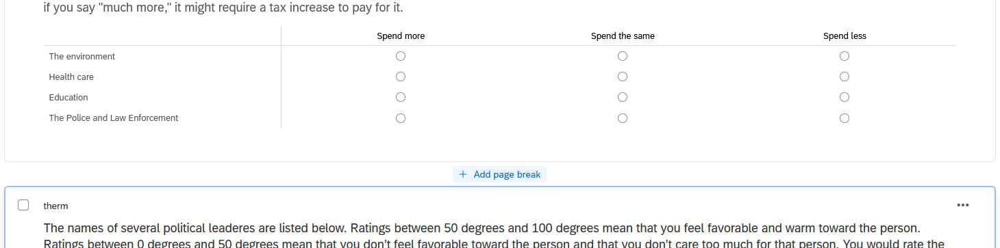

This is how things will look after clicking on the option:

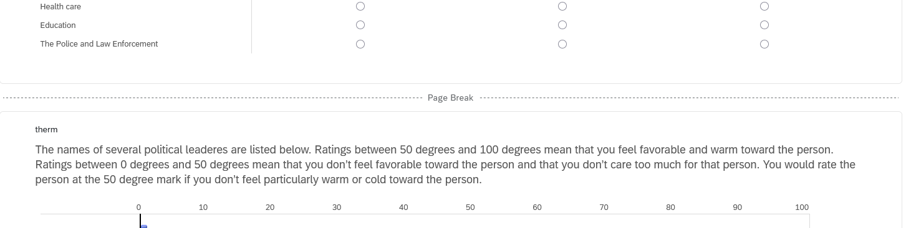

In general, I would recommend limiting the number of questions on a single page to keep the survey manageable for your respondents. I typically default to a single question per page although there are some areas where I might have two or three (e.g., basic demographics). There are some places where I might deviate from this suggestion though. For instance, suppose I am interested in measuring some latent psychological concept that is typically measured via a somewhat long multi-item battery (e.g., need for cognition or the Big Five personality traits). I would not create twenty different pages for each question in the (short) Big Five inventory, but likely four or five pages each with multiple questions. This might be a place where a grid question would be useful.

### Timing questions

One question type not discussed above but which may be useful to you are [timing](https://www.qualtrics.com/support/survey-platform/survey-module/editing-questions/question-types-guide/advanced/timing/){target="_blank"} questions. A timing question does what it says - it records how long respondents take on the survey page. We can add it via the "Add a new question" option as seen below. Q4 is what the timing question looks like within the question block.

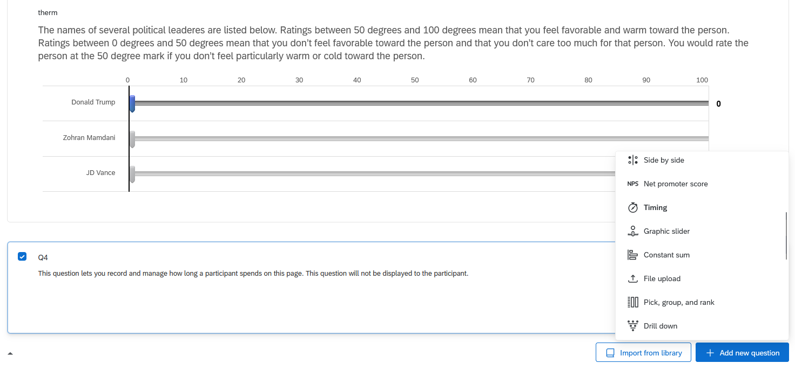

The Timing question will record four things for you:

-   How many seconds before the first click on the page (First Click)
-   How many seconds before the final click on the page (Last Click)
-   How many seconds before the respondent clicked to the next page, i.e., submitted their response (Page Submit)
-   How many times they clicked on the page (Click count)

The most useful thing here is the Page Submit entry. This can be particularly useful for thinking about (or even analyzing) how long people thought about the question you are asking, perhaps as an indicator for the degree of cognitive elaboration people are employing when answering.

One thing to note: be mindful of the page breaks here. The Timing question focuses on how long people take on the page as a whole. If you want to measure how long they take on a specific question, then that question should be provided on its own separate page by inserting page breaks before and after the question (and making sure the Timing question is also placed within those page break boundaries).

The Timing question is mainly used to track how long people take. However, we can also use it in an additional aspect: you can also use this option to make sure that respondents sit on the page for a give amount of time before being allowed to progress to the next page. This is sometimes used to prevent respondents from simply speeding through the survey and for increasing the chances that they engage with the material on the page. I would use that option sparingly if at all. See the Qualtrics page for this question (linked above) for more.

## Piping, Skipping, and more

Most of the time we ask a respondent a question and their answer does not matter for the rest of the survey. However, there can be scenarios where we might want to have a person's answer to a question influence the nature of future questions. This section discusses some possibilities.

### Display Logic {#sec-display-logic}

One way we can use people's responses to influence the rest of the survey is via Display and Skip logic. In essence, these cover situations where we want to display a subsequent question to respondents based on their response to an initial one or, alternatively, to skip questions based on prior responses. I'll give an example of the former in this sub-section.

A classic example here involves the measurement of partisan identification in the United States. The most common method is to first ask respondents a question such as: "Generally speaking, do you think of yourself as a Democrat, a Republican, an Independent, or what?". Respondents who select Democrat or Republican are then asked for the strength of this identification (is it strong or not very strong?). Respondents who indicate Independent, Other Party, or No Preference are instead given a follow up question where they are asked "Do you think of yourself as closer to the Republican Party or to the Democratic Party" with three response options: Closer to Republican, Closer to Democratic, or Nether. In this set up we need to ask respondents an initial question and then have our survey show them a specific follow up question based on their response to the initial question. We can do this via Display Logic.

I would begin by creating my questions. I would then add a page break between the initial question and the potential follow up questions as so:[^qualtrics_basics-6]

[^qualtrics_basics-6]: I have a separate strength question for those that said Democrat, and those that said Republican, to this initial question. We can actually simplify this and pose only one question by using Piped Text to also feed the specific response chosen on the initial question into the question wording of the follow up here. I will show that below.

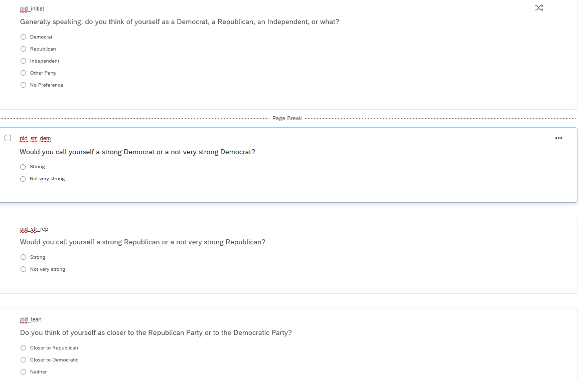

I now have to add Display logic to the three follow up questions. I do that by clicking on the question and navigating to the Display Logic option shown in the Question Behavior area. Here is what the process looks like for the Democrat question in this set up:

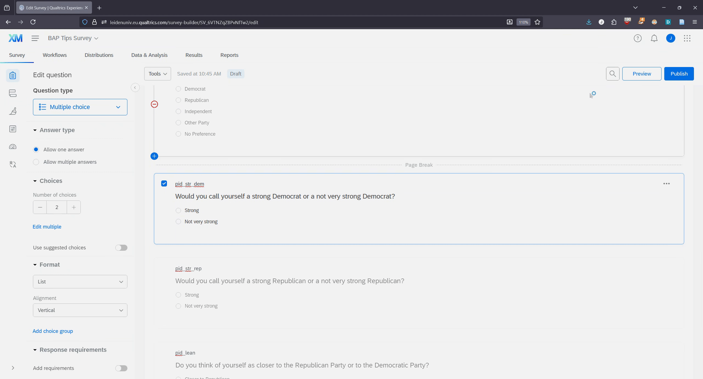

-   Click on Display Logic
-   Leave the first bit alone[^qualtrics_basics-7]
-   Under Select Question: find the initial question whose response you're using to set the logic
-   And select the option that is needed
    -   You can select multiple options here by adding another row via the green plus arrow. I will show an example below.

[^qualtrics_basics-7]: In this example at least. We can use other things in our Display Logic besides question responses.

Here is what the question now looks like:

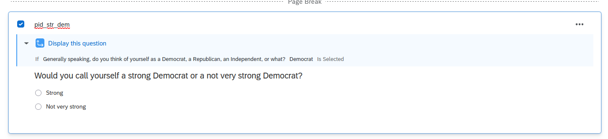

Basically, it says that this question will be displayed if the respondent answered Democrat to that initial "Generally speaking" question. I would then perform this same step for the other questions so that respondents only see the question that they should.

In my example, respondents should see the "Do you think of yourself as closer to..." question if they responded with Independent, Other Party, or No Preference to the initial item. Here is what that would look like:

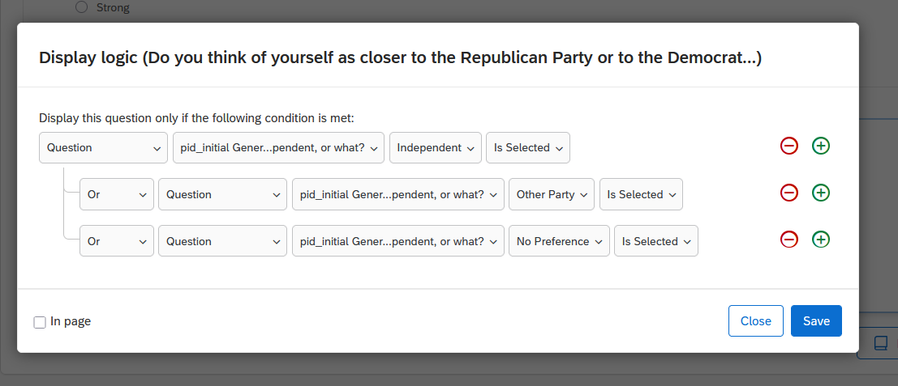

I needed to add a line/row for each individual response to the first PID question. The main thing to watch out for is the conditional logic part of the logic. You can see the "Or" option at the start of the second two rows. Basically, we are telling Qualtrics to show respondents this question if they said Independent *or* they said Other Party *or* they said No Preference. The alternative option for the logic is "And": if they said Independent and Other Party and No Preference. That would not work in the current instance because respondents could only pick one response. If I left this at "And", then nobody would actually get shown this question. The "And" option is perhaps more useful if you're setting up Display Logic using multiple questions or, perhaps, some type of multi-option multiple choice question.

### Piped Text

Another way that we can use answers from one question to influence another is via Piped Text. Specifically, this enables us to pipe the text of the selected option from one question into a subsequent question. The example in the previous sub-section is a good example of when this might be helpful. I initially created two follow up strength questions, one for Democrats and one for Republicans. However, I can simplify matters in this particular instance by piping in text. Let's see what that looks like.

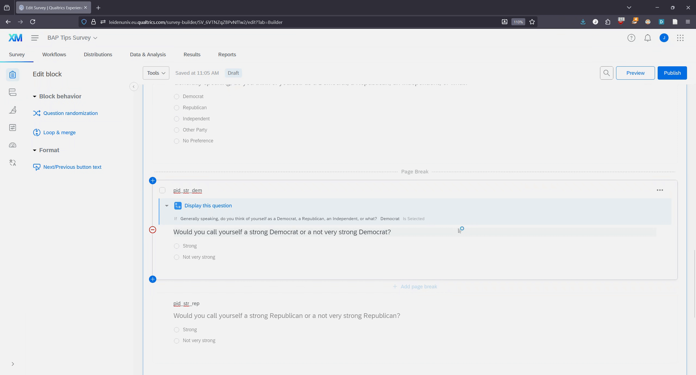

I begin by clicking on my question and starting to edit the question text. I delete the text for "Democrat" and then click on piped text. This gives me a drop down box with various options. In my case, I want to pipe text from a survey question so I click on that option. I then find my question where I'm given various other options for what I can pipe in. Here, I want to pipe in the text for the response option that the respondent selected. I then do the same for the ending part of the sentence "not very strong \[piped text\]" (not shown in the .gif).

Here is what the final question now looks like:

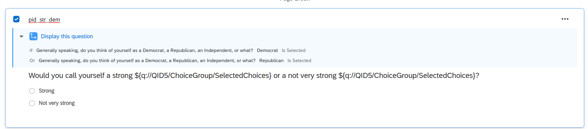

If respondents selected "Democrat" in the first question, then this one will read "Would you call yourself a strong Democrat or a not very strong Democrat?". If they answered "Republican" on the first question, then Republican would instead by inserted. I also updated the display logic so that only those respondents that gave either ("Or") of those two responses on the initial question will see this follow up question.

Of note here: you need to force responses to the initial question to make sure this Piped Stuff works the way it should work.

### Skip Logic and Consent Pages {#sec-skip-logic-and-consent-pages}

Earlier we saw how to selectively display questions based on responses to an initial question. We can use Skip Logic to similar ends: use the response to one question to inform whether Qualtrics *skips* a subsequent question (or questions).

Perhaps the most relevant place to use Skip Logic is in combination with your very first question on the survey: the informed consent question. Every survey should begin with a question informing respondents about the basics of the survey and asking them for their informed consent. Respondents who answer affirmatively here can take the survey while those that do not give consent do not - they should, in essence, skip the entire survey. Let's see what this would look like in practice.

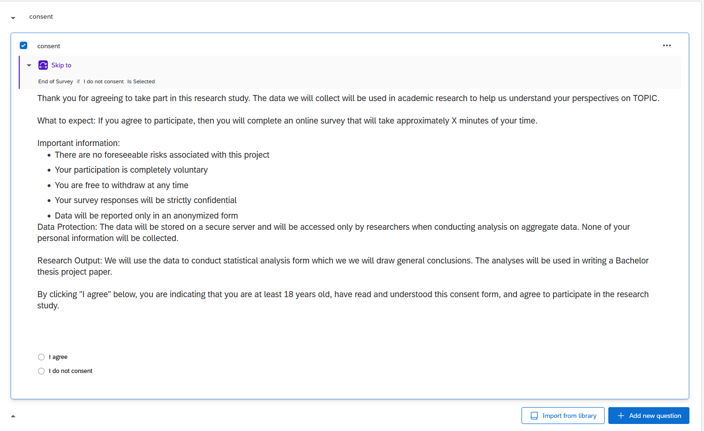

The image above shows the final product. What did I do?

-   I created a new block which I named consent. The name is only important for me since the respondents are not shown it.
-   I went into the Survey Flow and moved this block to the very beginning of the survey (see below).
-   I added a multiple choice question (which I named "consent"). The body of the question provides a short description of what the survey is about, what they'll be asked to do, informs them of their ability not to consent and to withdraw participation, and ultimately asks whether they consent or not.
    -   You can add bullet points like this by clicking on the Rich Content Editor when editing the question wording.
-   I then added the Skip Logic. The process here is similar to adding Display Logic. Here, if the person clicks "I do not consent", then the next page will be the end of survey page, i.e., they will not be shown any substantive questions.

One **important** point: you **need** to add a Force Response option to this consent question as otherwise people who do provide any answer would still be shown the survey.

Here is what the survey flow (currently) looks like:

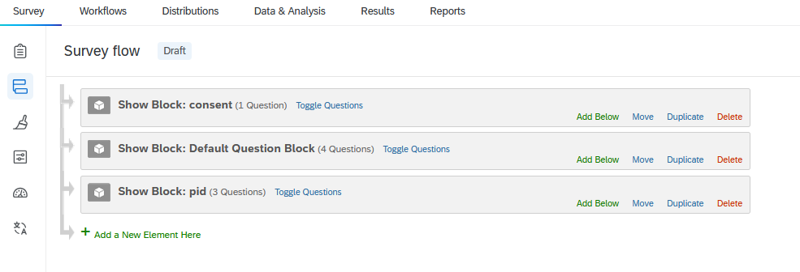

### Branches {#sec-branches}

Another way we can selectively show people information is by creating survey branches. Here, we can selectively show people *question blocks* based on their responses to prior questions.

Let's stick with our partisan identity example. We might want to measure the strength of a person's identification with their party using a multi-item scale to obtain a more accurate measure. I have added a new block to my survey with three such questions drawn from work by [Huddy, Bankert, and Davies](https://doi.org/10.1111/pops.12482){target="_blank"} .

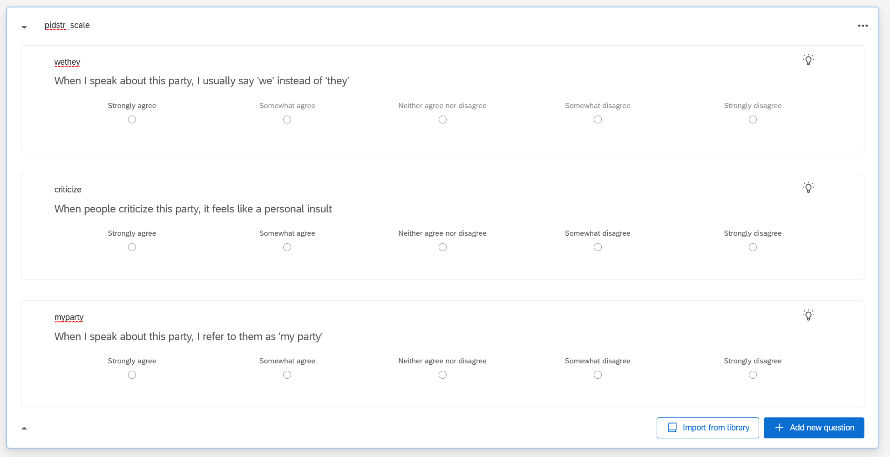

Let's say that I wanted to show this block of questions only to those people that said they were a Democrat or Republican on the initial question or indicated that they were close to a party on the leaner follow up question. A good way to do this is to create a survey branch. Here is a gif that shows the basic process:

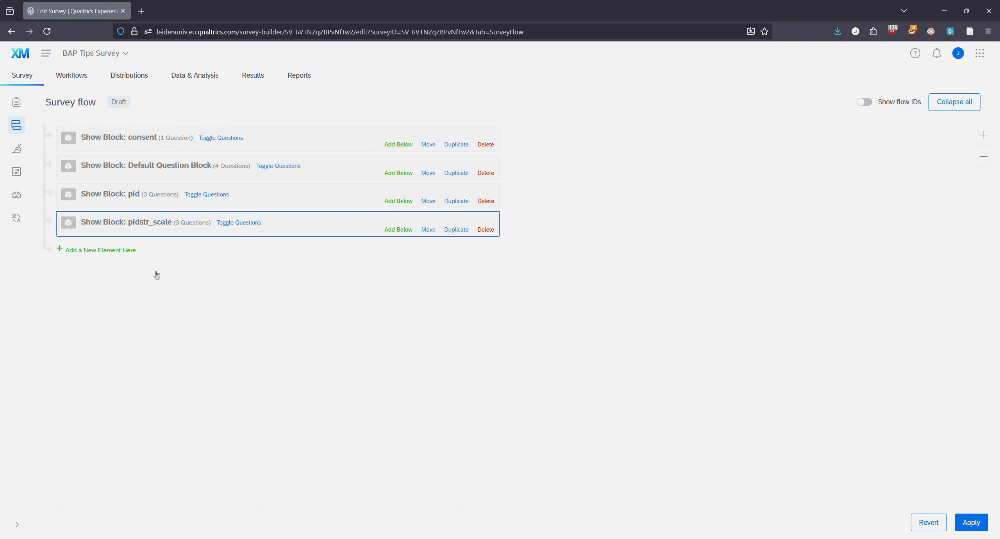

What am I doing:

-   Go to Survey Flow
-   Click on the block that you want to branch from and select Add Below
-   Select the Branch Option
-   Move the block (or blocks) you want in the branch into the Branch
-   Select options and set the logic for the branch

Here is what the final product looks like:

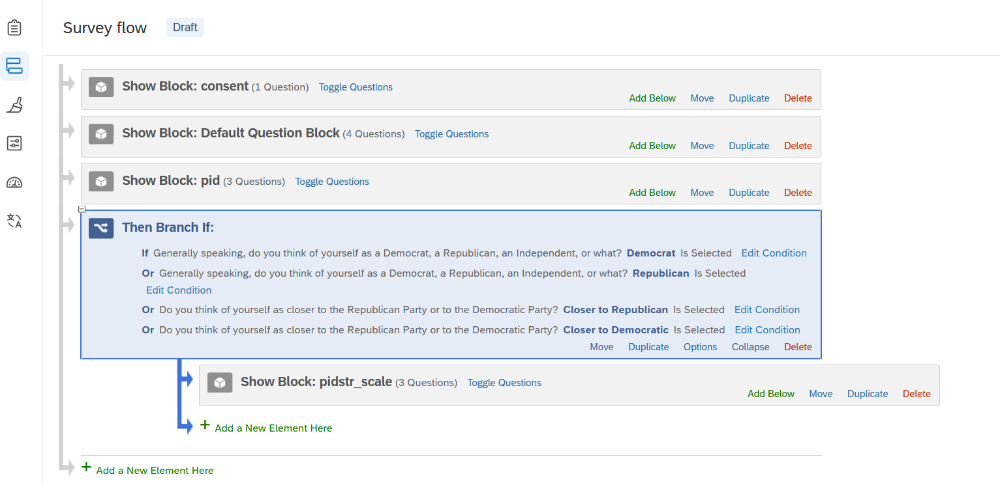

In essence: If the repondent said Democrat or Republican to the initial partisanship question, or said Closer to Republican/Democratic to the leaner question, then they should be shown this block with the three identity strength questions. If those options are not true, then they are not shown the block.

#### Bonus: question randomization within a block {#sec-bonus-question-randomization-within-a-block}

I just created a block with three PID strength questions. Earlier we saw how we can randomize the order of choices for a single question. Here, I will show you how to randomize the order of questions within a block.

Click on an area in the block - by the block name and above the first question is a good place. This will bring up an options menu on the left hand side for Block Behavior with a Question Randomization option.

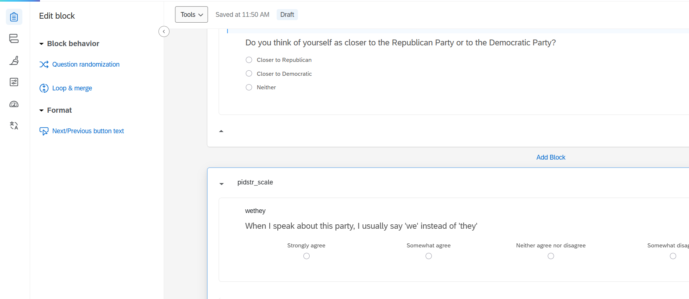

Click on that option and set up randomization much like we did for response options earlier:

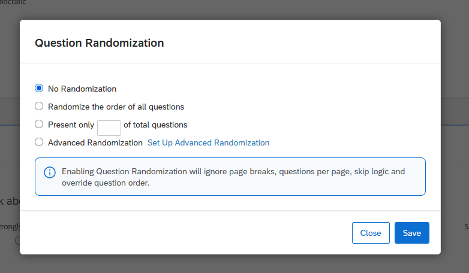

The pop up here displays a very relevant message: randomizing questions within a block ignores page breaks! This option is thus not often so useful, but if you have a short block and want to randomize questions within it, then this is how you'd do it.
