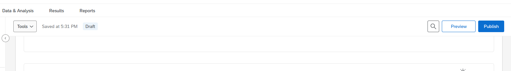
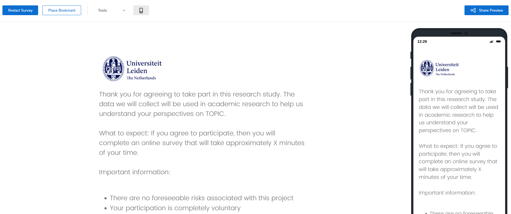
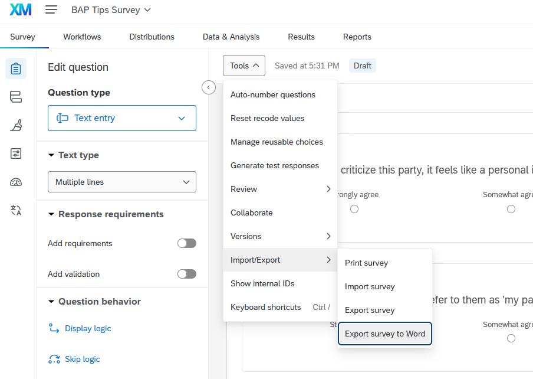
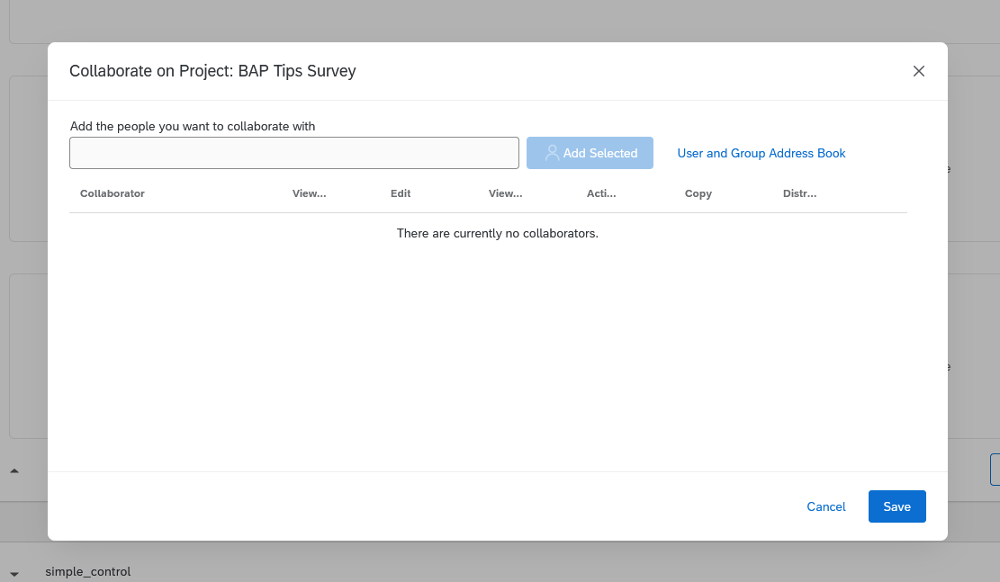
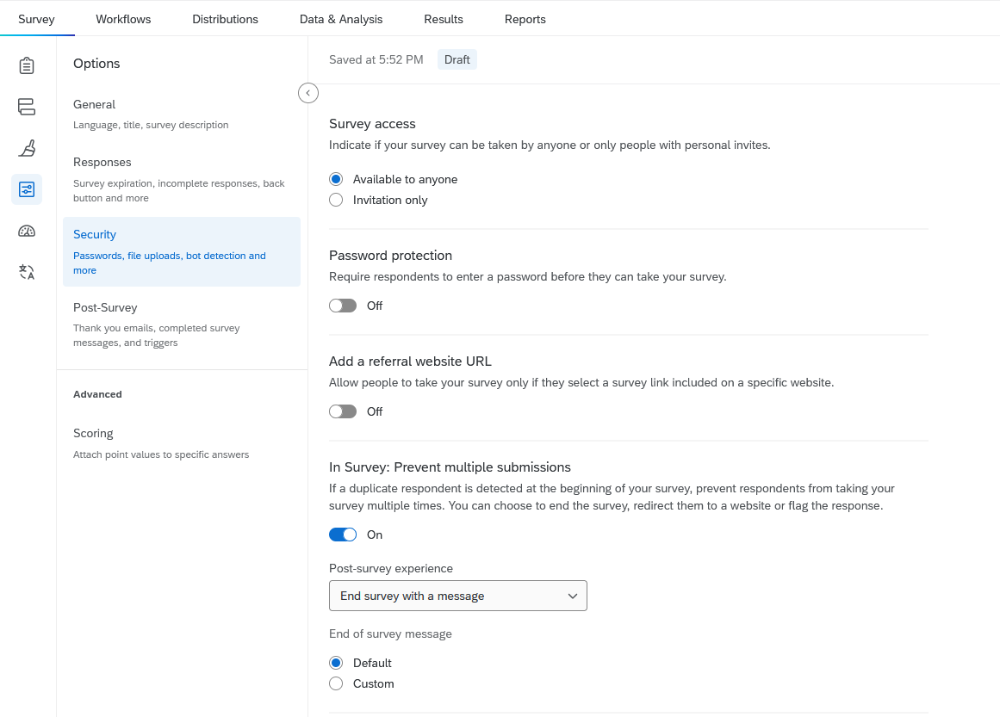
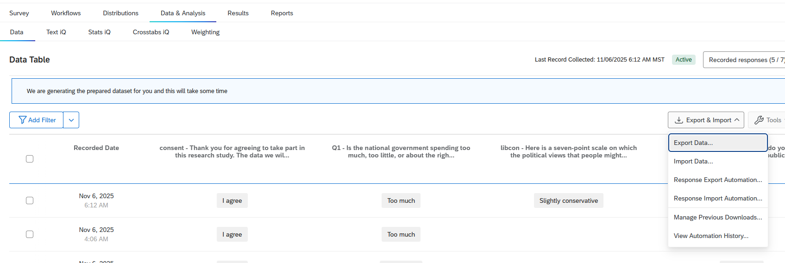
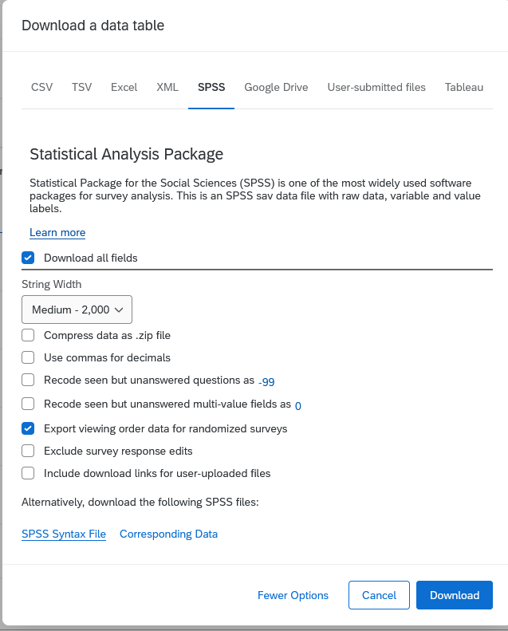
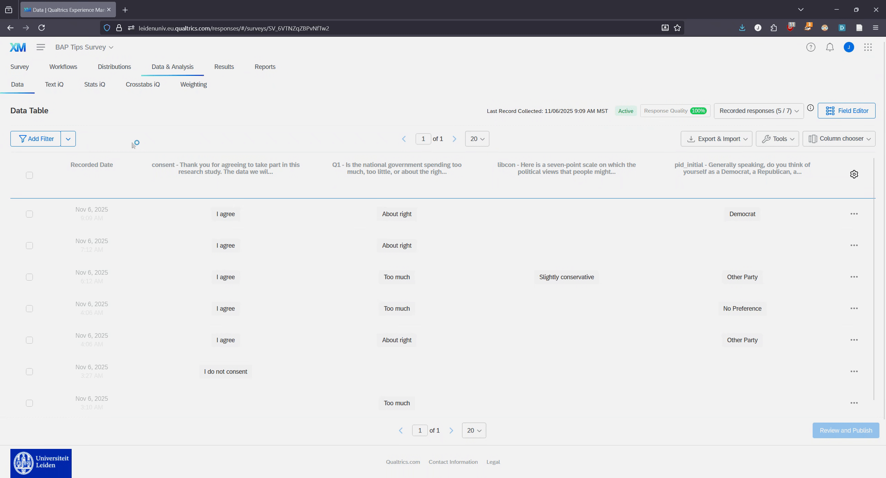

# Finalizing, Distributing, and Data Downloading

The previous two chapters have focused on the basics of setting up your survey. This chapter considers some of the practicalities involved in creating a survey (e.g., how should it be structured), how you actually do this, and how you get your data from the Qualtrics platform.

## Survey Structure

Very basically, your survey should be structured as so:

-   Consent
-   Survey Questions
-   Thank you and debrief
-   End of survey

The very first thing is to ask respondents for their consent with non-consenters filtered out as shown in @sec-skip-logic-and-consent-pages. Then you ask them the questions you want to ask them. Your survey ends with a block that contains some type of thank you for participating and some information about the experiment that you ran (i.e., you debrief them as to what happened). They then finish the survey.

How should you set organize the "Survey Questions" part. If you're collecting survey data yourself then it is likely because you are running your own experiment. In such cases we can think of three basic parts to the survey:

-   Pre-test
-   Treatment
-   Post-test

The pre-test part sees you ask questions that you might want to use as moderators in your ensuing analyses. The treatment part sees you randomly assign respondents to treatment groups with subsequent questions relating to the experiment. Finally, there may be a post-test part where you ask additional questions and particularly questions that are not likely to be used in your analyses but which may give insight into the characteristics of the sample (e.g., sample demographics).

## Preview, Preview, Preview {#sec-preview-preview-preview}

One thing you should do: preview your survey! You should take the survey multiple times yourself to make sure that everything is working the way it should be. (You should also download the data from your survey previews to see what it looks like too and make sure there isn't some obvious issues; see below). You can do this by clicking on the Preview button at the top of the page:

This will launch a preview version of your survey that you can work through. You can also toggle a mobile version when taking the preview so that you can get a sense of how the survey would look if taken via cell phone.

## Downloading the Survey Questionnaire

Make sure to download the survey questionnaire as a Word file when you are ready to submit the survey to other people. This Word version of the questionnaire can serve as a bit of a codebook for you later on because it includes information on the numeric codes associated with response options.

## Adding me as a collaborator

You should add me a collaborator on the survey so that I can see what you have done and preview the survey as well. This is a further guardrail for you as I may be able to spot issues that you do not.

Click on the Tools menu (seen in the image above) and select Collaborate. You should then be able to add me to the survey using my Leiden email address in the ensuing option box. See the [Qualtrics](https://www.qualtrics.com/support/survey-platform/my-projects/sharing-a-project/#SharingInsideYourOrganization){target="_blank"} page on this process.

## Prevent Multiple Submissions

You probably do not want someone to take the survey multiple times as this will undermine the integrity of your data. You can prevent multiple submissions in Qualtrics (see Qualtrics [help page](https://www.qualtrics.com/support/survey-platform/survey-module/survey-options/survey-protection/#PreventingRespondentsFromTakingYourSurveyMoreThanOnce){target="_blank"}). You can do this by going to the Settings tab, Secuity, and then the "Prevent multiple submissions" option.

## Publishing and Distributing

You can distribute the survey by doing the following:

-   Click on the Publish button and walk through the ensuing [options](https://www.qualtrics.com/support/survey-platform/survey-module/survey-publishing-versions/){target="_blank"}
-   Click on the [Distributions](https://www.qualtrics.com/support/survey-platform/distributions-module/distributions-overview/?parent=p00183){target="_blank"} tab and then select the "Get a single reusable link" option under "Use your own email system". You can then distribute this link to others
    -   If you go back to the Distributions tab after selecting this option, then you will be able to re-find the link in the "Anonymous Link" area

## Downloading Data {#sec-downloading-data}

You're ready to download the data and analyze it. How do you do this? First, go to the Data & Analysis tab and then select Export Data from Export & Import.

You can download the data in various data formats. My suggestion is to actually download this as an SPSS file. SPSS files are propriety data files, which is not something we should generally promote. At the same time, you can still load them in R (and, of course, in SPSS) and they have a key advantage over other types of files such as .csv files: they will include variable attributes in the data including value labels. This makes working with the data much easier since you will be able to inspect the data in R/SPSS and see what a 1 or a 2 or whatever actually means on the variable.[^quarto_finalizing_distribution_data-1]

[^quarto_finalizing_distribution_data-1]: This information is also recorded in the questionnaire that you can download as a Word document. Having some type of information on this front is important because very occasionally the numeric codes for response options can get screwed up during the editing process in Qualtrics (e.g., instead of 1-5 they might be 4-8 for some reason).

A further important thing to do here: make sure your dataset includes a variable indicating the results of the randomization process(es) in your survey! To do that, click on the More Options button and select "Export viewing order data for randomized surveys". This will create a column in your dataset for each randomizer in your survey flow.

::: callout-warning
Remember to filter out survey previews before analyzing your data!
:::

Per above, you should preview your survey multiple times before you send it to anybody. I would also recommend downloading the dataset after you've done your previews to get a handle on its basic structure. This brings up an important point though: survey previews data will be included in your final dataset by default! You thus need to take an extra step to filter them out of your data before performing any analyses. You can do this in either of two ways.

First, you can download the data as is and filter the data in R/SPSS. The dataset should include a column/variable named Status that records the type of survey response involved. It also makes sense at this point to filter out any respondents that did not agree to the consent question as well.

Second, you can filter these responses out of the data before downloading from Qualtrics. You can do this by creating a filter in the Data & Analytics page to filter out survey previews and then downloading the data; see the .gif below. I do caution you: if you take this route, make sure you double check things in your final dataset before you perform any analyses.

