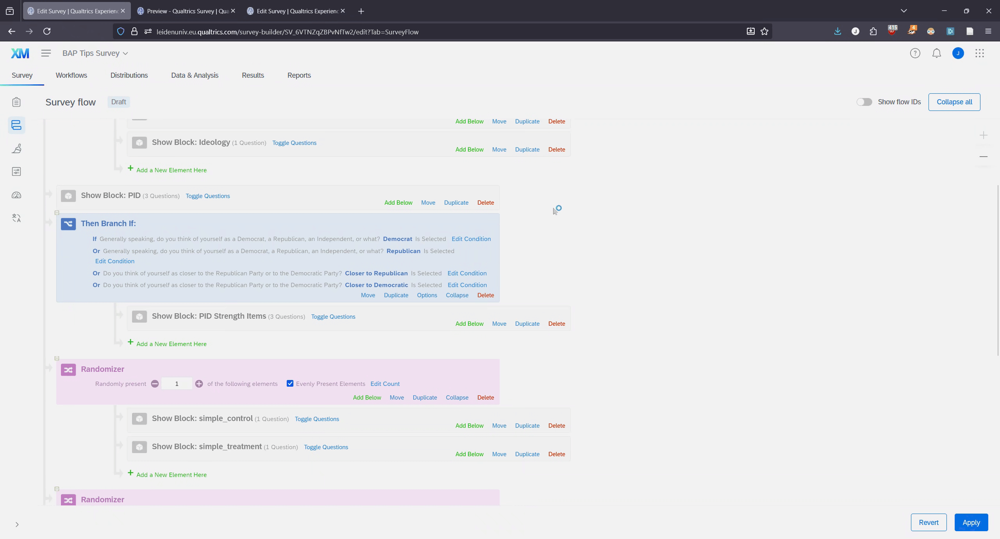
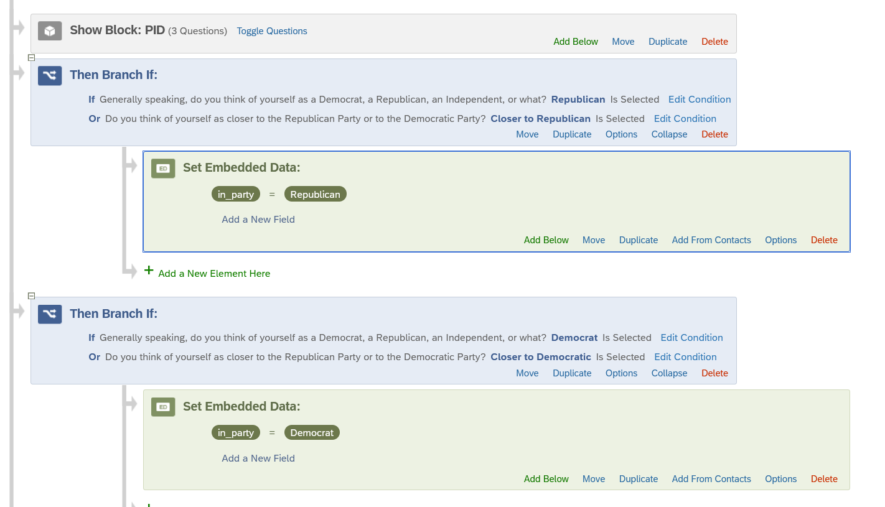
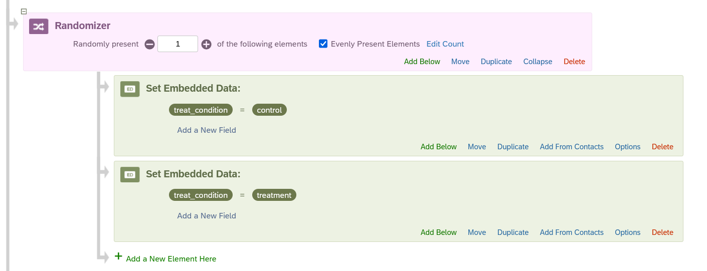
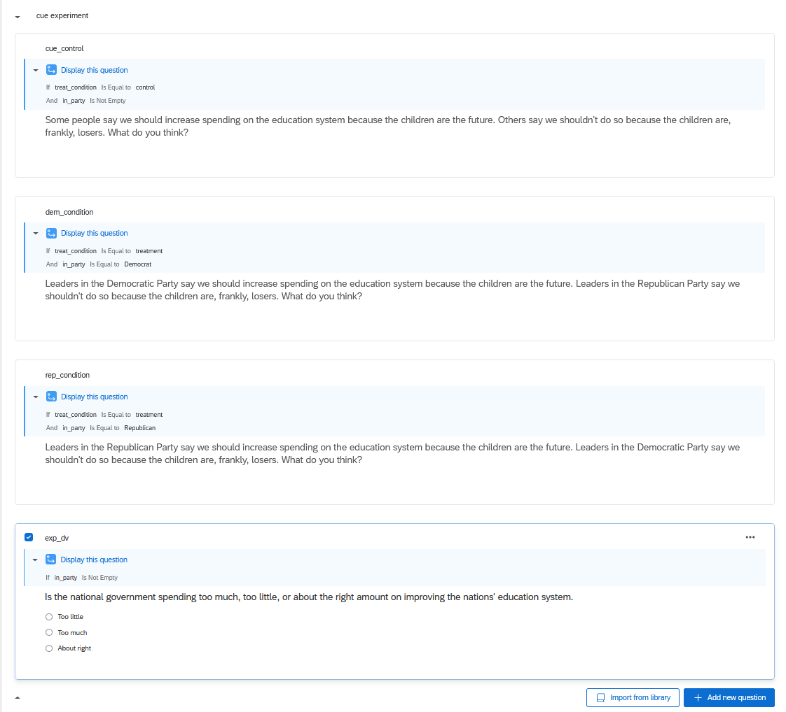

# Advanced Randomization (Inc. Experiments)

@sec-qualtrics-basics showed you how to set up a survey. In doing so, I discussed how to randomize some elements of a question, e.g,. the order of response options. This chapter will focus on randomizing the order of question blocks themselves. This is particularly important if you're incorporating a random experiment in your survey.

## Randomizing Block Order {#sec-randomizing-block-order}

We'll start with a basic example where we want to show respondents **each** of a set of blocks but simply want to randomize their order. Let's take a look at the current survey flow for my survey:


The survey is organized as so:

-   consent: This block has the consent question, and its Skip Logic, that was shown in @sec-skip-logic-and-consent-pages
-   Feeling Thermometers: This block has the slider questions that I created in @sec-adding-new-questions
-   Spending Preferences: This block has the multiple choice questions focused on people's spending preferences that I created in the last chapter
-   Ideology: This is a new block that feature a single question asking people their liberal/conservative ideology
-   PID: This is the three-item PID question created in @ec-display-logic
-   Then we get a branch based on the PID question as shown in sec-branches @sec-branches

Let's say that we wanted to show respondents the Feeling Thermometers, Spending, and Ideology branches but in random order (e.g., some people would get the blocks in this order but others would see Ideology then Spending then Feeling Thermometers, etc.). This might make sense if we were concerned that asking these questions in a particular order might lead to some type of priming effect that we wanted to avoid. Here is a gif that shows the basic process:


-   Go to Survey Flow
-   Click Add Below for a block at the approximate part of the flow where you want to add the randomization element
-   Click [Randomizer](https://www.qualtrics.com/support/survey-platform/survey-module/survey-flow/standard-elements/randomizer/){target="_blank"}. This creates a sort of branch like entry
-   Move the blocks that you want to include in the randomization within this area
-   Make sure you're showing the right number in "Randomly Present" area.
    -   I moved three blocks into this area. I want all shown but in random order. I thus need 3 in this option. If I only wanted to show a random sample of 1 of those blocks (for instance) then I would alternatively have 1 in this area. The big thing here is to make sure you have the right number for what you want!
    -   I also clicked on 'Evenly Present Elements'. This makes is to that potential sample (here, sample of block orders) is shown a "roughly equal number of times across all respondents"
-   Click on apply to make sure you save your work

::: callout-warning
Be very careful with randomizers. In particular, if you set up a randomizer and then add a new block after it, then it very likely will get automatically added to your randomizer by Qualtrics without you noticing it. Triple check your work in the Survey Flow!
:::

## Randomized Experiments

One potential use case for randomization is experimentation. You may want to randomly assign some respondents to, say, a "Control" group and another set to a "Treatment" group with the questions/blocks shown to these groups varying. The simplest way forward is to use the same steps shown in @sec-randomizing-block-order but with one crucial difference. Here, you would:

-   Create a block for each treatment group
-   Insert a randomizer before the first block in Survey Flow
-   Nest all of the relevant blocks into this randomizer
-   Set "Randomly Present" to 1 (i.e., "Randomly Present 1 of the following elements"

Here is an example:


I created a block for my treatment group ("simple_treatment") and one for my control group ("simple_control"). I then added them to a randomizer and set it so that only one element would be (randomly) shown to respondents.

This method is easy and straight to the point. There are a few very small annoyances with this approach that I'll note here:

-   You'll need to explicitly tell Qualtrics to add a column to the dataset with the results of the randomizer so that you know which group people were assigned to (see @sec-downloading-data).
-   The name of this column tends to be pretty uninformative on its own (in my instance right now: "FL_18_DO").
-   There will be a measurement of your DV in each block that you will need to combine later on into a single measure in R/SPSS. This process in R is likely best handled via a `case_when()` command like this (although, naturally, you would need to update this to reflect the contents of the randomizer variable in your dataset and the names of the variables for your DVs):

```{r}
#| eval: false

data <- data |> 
  mutate(
    dv_name = case_when(
      FL_18_DO == "simple_treatment" ~ var1, 
      FL_18_DO == "simple_control" ~ var2
    )
  )

```

None of the above issues is all that problematic in the long run, but I wanted to mention them now regardless.[^quarto_randomization-1]

[^quarto_randomization-1]: There are some things we could do to address these annoyances, although they naturally involve their own effort and so I don't show them here for simplicity's sake.

A further point here: this works best if the contents of the different blocks that you are randomizing is pretty simple (e.g., just the treatment or perhaps the treatment and a single DV item). If you have lots of additional follow up questions in your question then you can have a single question block for those questions that comes after the randomizer bit in your survey flow.

## Branching and Embedded Data

The foregoing approach will cover most of your use cases. However, I do want to touch on one further example that involves a more elaborate set up to demonstrate some additional tools available to you.

What if the nature of the treatment needs to depend, in some way, on a prior question on the survey? For instance, let's say that I wanted to perform a party cueing experiment wherein *only partisans* were randomized into treatment or control. The control group would simply indicate that some people support a poilcy and others oppose it, while the treatment condition would instead indicate that the respondent's in-party supports the policy and their out-party opposes it. This is possible to do in Qualtrics, but it will involve some branching (see @sec-branches) and the use of [Embedded Data](https://www.qualtrics.com/support/survey-platform/survey-module/survey-flow/standard-elements/embedded-data/){target="_blank"}, "any extra information you would like to record in your survey data in addition to the question responses". Let's walk through the process.

I need to know if the person is a partisan or not and, if so, with which party they identify so I can show partisans assigned to a treatment condition the correct in-party. I already have partisan identity questions in the survey for this purpose. What I want to first do is set up an "Embedded Data" option to record people's response on this front for later use. This is a little tricky in my instance because partisans, in my example, should include people who said Democrat/Republican to the initial question and Closer to Democratic/Republican on the leaner question. Here is a gif showing the basic logic of how I will do that:



What am I doing?

-   I go to the PID block and click Add Below
-   I select the branch option and populate it so that the branch is only triggered if the respondent said Democrat to the initial PID question or closer to Democratic on the leaner question
-   I then add embedded data under the branch
-   The first thing I write is "in_party" - this is the name for the embedded data column (and would be the name of the variable in your resulting dataset)
-   I then click "Set value now" and write "Democrat"

In essence: if the respondent says Democrat/Closer to Democratic in the PID block, then the survey will do a branch behind the scenes, create a column named "in_party", and populate that column with "Democrat".

I went through this process once more to do the same for Republican respondents. Here is what the survey flow currently looks like:



I now have the respondent's partisanship recorded in the survey. This can be used later on for creating new branches in the survey or setting up display logic (see below).

I can now turn my attention to randomizing respondents intro either a control or treatment group. I will also use Embedded Data here to do this.



Here, I created a ranomizer and added two Embedded Data entries within it. The name of the embedded data field is "treat_condition". Respondents will be randomized either an embedded data value of "control" or of "treatment".

I use all of this embedded data in a Display Logic set up to show respondents the correct treatment:



What I did:

-   I created a single question block for the experiment
-   I created three text questions that contain the content of the experiment: corresponding to the control group, one for the treatment group where the Democrats are the in-party, and one for the treatment group where Republicans are the in-party.
-   I set up Display Logic to show the right question to the right respondent based on the combination of the two embedded data fields I created earlier
    -   The Display Logic for the Control group has an "And" logic: if treat_condition = "control" and in_party is *not NA*, then show this question. I did this to make sure that pure Indpendents were not shown any question here.
-   Finally I have the common DV that respondents are asked to answer.
    -   I set a Display Logic here as well to make sure that Pure Independents did not see this question. An alternative would have been to use a Branch prior to this block to make it so that only respondents with embedded data on the "in_party" embedded data option were shown the block.
