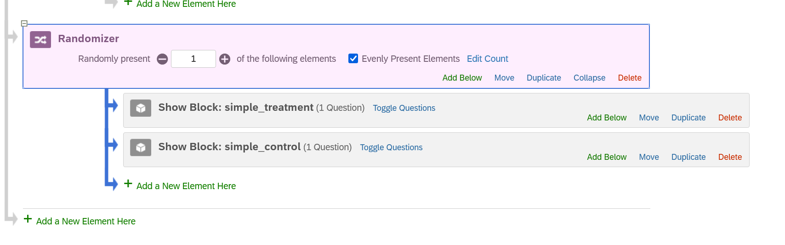

# Advanced Randomization (Inc. Experiments)

@sec-qualtrics-basics showed you how to set up a survey. In doing so, I discussed how to randomize some elements of a question, e.g,. the order of response options. This chapter will focus on randomizing the order of question blocks themselves. This is particularly important if you're incorporating a random experiment in your survey.

## Randomizing Block Order {#sec-randomizing-block-order}

We'll start with a basic example where we want to show respondents each of a set of blocks but simply want to randomize their order. Let's take a look at the current survey flow for my survey:

The survey is organized as so:

-   consent: This block has the consent question, and its Skip Logic, that was shown in @sec-skip-logic-and-consent-pages
-   Feeling Thermometers: This block has the slider questions that I created in @sec-adding-new-questions
-   Spending Preferences: This block has the multiple choice questions focused on people's spending preferences that I created in the last chapter
-   Ideology: This is a new block that feature a single question asking people their liberal/conservative ideology
-   PID: This is the three-item PID question created in @ec-display-logic
-   Then we get a branch based on the PID question as shown in sec-branches @sec-branches

Let's say that we wanted to show respondents the Feeling Thermometers, Spending, and Ideology branches but in random order (e.g., some people would get the blocks in this order but others would see Ideology then Spending then Feeling Thermometers, etc.). This might make sense if we were concerned that asking these questions in a particular order might lead to some type of priming effect that we wanted to avoid. Here is a gif that shows the basic process:

-   Go to Survey Flow

-   Click Add Below for a block at the approximate part of the flow where you want to add the randomization element

-   Click [Randomizer](https://www.qualtrics.com/support/survey-platform/survey-module/survey-flow/standard-elements/randomizer/){target="_blank"}. This creates a sort of branch like entry

-   Move the blocks that you want to include in the randomization within this area

-   Make sure you're showing the right number in "Randomly Present" area.

    -   I moved three blocks into this area. I want all shown but in random order. I thus need 3 in this option. If I only wanted to show a random sample of 1 of those blocks (for instance) then I would alternatively have 1 in this area. The big thing here is to make sure you have the right number for what you want!
    -   I also clicked on 'Evenly Present Elements'. This makes is to that potential sample (here, sample of block orders) is shown a "roughly equal number of times across all respondents"

-   Click on apply to make sure you save your work

## Randomized Experiments

One potential use case for randomization is experimentation. You may want to randomly assign some respondents to, say, a "Control" group and another set to a "Treatment" group with the questions/blocks shown to these groups varying. There are a few different ways we can do this each with advantages/disadvantages. The following sub-sections walk through the possibilities starting from the simplest route to more complex examples.

### Option 1: Randomize Block Order Route

The first possibility here is to walk through the same steps as shown in @sec-randomizing-block-order but with one crucial difference. Here, you would:

-   Create a block for each treatment group
-   Insert a randomizer before the first block in Survey Flow
-   Nest all of the relevant blocks into this randomizer
-   Set "Randomly Present" to 1 (i.e., "Randomly Present 1 of the following elements"

Here is an example:

I created a block for my treatment group ("simple_treatment") and one for my control group ("simple_control"). I then added them to a randomizer and set it so that only one element would be (randomly) shown to respondents.

This method is easy and straight to the point. There are a few very small annoyances with this approach that I'll note here:

-   You'll need to explicitly tell Qualtrics to add a column to the dataset with the results of the randomizer so that you know which group people were assigned to. I'll discuss exporting data in **CHAPTER XX**.
-   The name of this column tends to be pretty uninformative on its own (in my instance right now: "FL_18_DO").
-   There will be a measurement of your DV in each block that you will need to combine later on into a single measure in R/SPSS.

None of the above issues is all that problematic in the long run, but I wanted to mention them now regardless. Some of these issues might also be addressable in Qualtrics by setting "embedded data" as discussed below.

Overall, this route is probably what you will take if you're setting up an experiment in Qualtrics. However, I want to show two other examples.

### Option 2: Setting and Using Embedded Data

I mentioned a few small annoyances above. We can avoid these annoyances, and perhaps set ourselves up to employ more advanced randomization processes if necessary, via the use of [Embedded Data](https://www.qualtrics.com/support/survey-platform/survey-module/survey-flow/standard-elements/embedded-data/){target="_blank"}. Embedded data is " any extra information you would like recorded in your survey data in addition to the question responses". This can be useful for experiments because it can enable us to record in the survey itself what group the respondent was randomly assigned to in a variable that we name ourselves and which will be automatically included in our final dataset. It may also be useful for avoiding the final complication above (the one about multiple variables needing to be combined), although this depends on what you're trying to do.

Let's start with a simple example. I have an experiment where I want to assign respondents to either of two groups. Respondents in both groups will read information about a candidate for office. This information differs in whether the candidate's slogan is generic (our control group) or represents a policy appeal involving taxing the rich. Per above, I could create two separate blocks and randomize which one shows up for the respondents. Here, I'll take a slightly different track. I'll begin, as above, with a randomizer but here I'll use embedded data. Here is what that looks like:

Teh basic logic will be to create a randomizer and use it to randomly assign people to treatment; save this assignment as "Embedded Data" within the survey/Qualtrics; use this Embedded Data in subsequent display logic (?) or branches.

### Option 3: Branches

if Democrat: randomize into out-group threat or in-group threat

if Republican:
