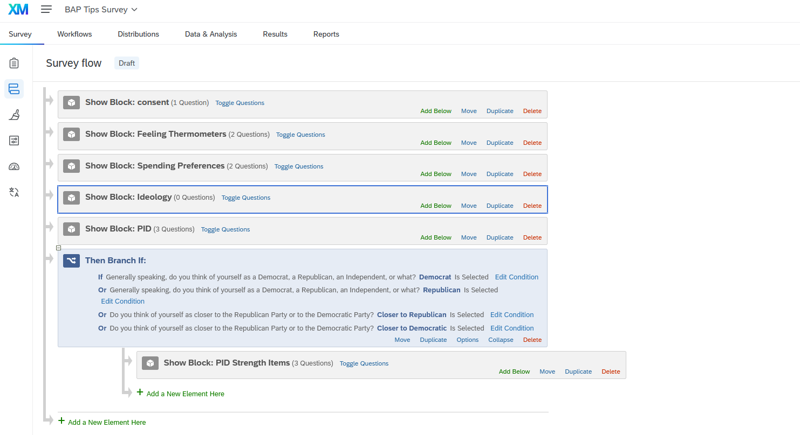
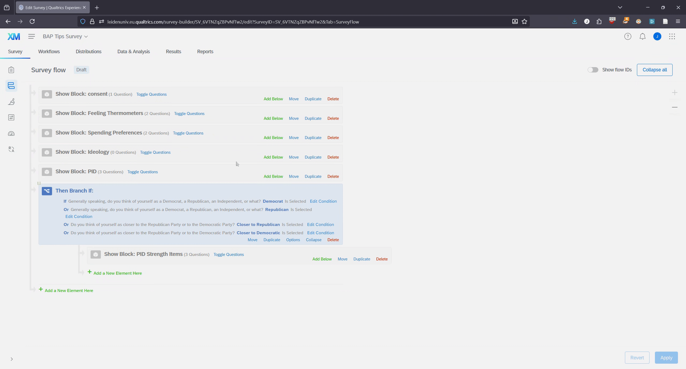

# Randomization: Blocks

@sec-qualtrics-basics showed you how to set up a survey. In doing so, I discussed how to randomize some elements of a question, e.g,. the order of response options. This chapter will focus on randomizing the order of question blocks themselves. This is particularly important if you're incorporating a random experiment in your survey.

## Randomizing Block Order

We'll start with a basic example where we want to show respondents each of a set of blocks but simply want to randomize their order. Let's take a look at the current survey flow for my survey:

The survey is organized as so:

-   consent: This block has the consent question, and its Skip Logic, that was shown in @sec-skip-logic-and-consent-pages
-   Feeling Thermometers: This block has the slider questions that I created in @sec-adding-new-questions
-   Spending Preferences: This block has the multiple choice questions focused on people's spending preferences that I created in the last chapter
-   Ideology: This is a new block that feature a single question asking people their liberal/conservative ideology
-   PID: This is the three-item PID question created in @ec-display-logic
-   Then we get a branch based on the PID question as shown in sec-branches @sec-branches

Let's say that we wanted to show respondents the Feeling Thermometers, Spending, and Ideology branches but in random order (e.g., some people would get the blocks in this order but others would see Ideology then Spending then Feeling Thermometers, etc.). This might make sense if we were concerned that asking these questions in a particular order might lead to some type of priming effect that we wanted to avoid. Here is a gif that shows the basic process:

-   Go to Survey Flow

-   Click Add Below for a block at the approximate part of the flow where you want to add the randomization element

-   Click [Randomizer](https://www.qualtrics.com/support/survey-platform/survey-module/survey-flow/standard-elements/randomizer/){target="_blank"}. This creates a sort of branch like entry

-   Move the blocks that you want to include in the randomization within this area

-   Make sure you're showing the right number in "Randomly Present " area.

    -   I moved three blocks into this area. I want all shown but in random order. I thus need 3 in this option. If I only wanted to show a random sample of 1 of those blocks (for instance) then I would alternatively have 1 in this area. The big thing here is to make sure you have the right number for what you want!
    -   I also clicked on 'Evenly Present Elements'. This makes is to that potential sample (here, sample of block orders) is shown a "roughly equal number of times across all respondents"

-   Click on apply to make sure you save your work

## Randomized Experiments

Teh basic logic will be to create a randomizer and use it to randomly assign people to treatment; save this assignment as "Embedded Data" within the survey/Qualtrics; use this Embedded Data in subsequent display logic (?) or branches.

### Setting Embedded Data
